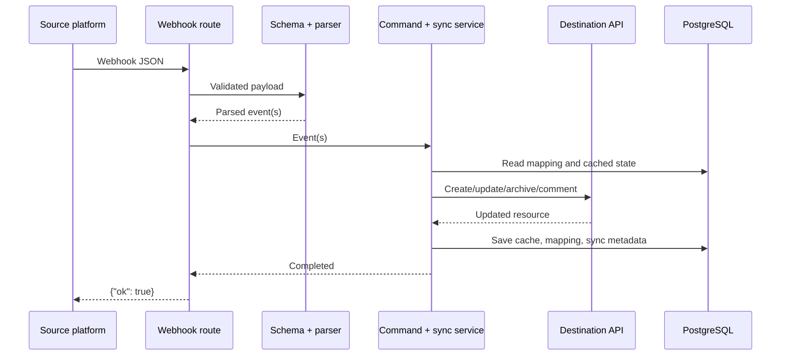

# End-to-End Data Flow

## Common Pipeline

Both directions follow the same conceptual pipeline:

```text
1. Provider sends webhook JSON
2. Route reads and validates the request
3. Zod schema validates the useful payload shape
4. Parser creates one or more normalized events
5. Command builder creates destination actions
6. Sync service checks mappings and likely echoes
7. Destination API is called
8. Local cached records and mappings are updated
9. Route responds to the provider
```



## Why Events and Commands Are Separate

An event describes what happened at the source:

```text
card.moved
```

A command describes what should happen at the destination:

```text
linear.issue.status_update
```

This separation keeps provider JSON details out of business logic and gives field mappings a clear home.

## Multiple Changes

Trello `updateCard` and Linear issue update payloads may contain several changed fields. Parsers collect every supported changed field and return an array of events. Services process the resulting commands sequentially.

## Create Flow

When no item mapping exists:

1. Create the destination item.
2. Cache the source and destination item data.
3. Create a unique Trello-card-to-Linear-issue mapping.
4. Mark the mapping with the originating sync source and timestamp.

Current limitation: the external item is created before the mapping is persisted. Concurrent retries can therefore race and create duplicates.

## Update Flow

When a mapping exists:

1. Read the mapping by source item ID.
2. Skip a likely echo when applicable.
3. Mark the source and sync timestamp.
4. Update the destination API.
5. Update cached source and destination state.

## Comment Flow

Comments use a separate mapping table linking a Trello action ID and Linear comment ID. This prevents already-mapped comments from being created twice in the opposite platform.

## Related Documents

- [Trello to Linear](../sync/trello-to-linear.md)
- [Linear to Trello](../sync/linear-to-trello.md)
- [Database Model](database.md)
- [Loop Prevention](../sync/loop-prevention.md)
