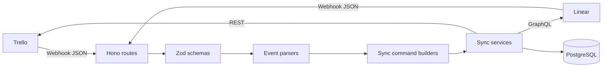

# Architecture Overview

## Purpose

The application keeps Trello cards and Linear issues usable as two interfaces for the same work item. It is event-driven: Trello and Linear send webhook JSON when an item changes, and the server applies an equivalent change to the opposite platform.

## System Diagram

## Components

| Responsibility | Location |
|---|---|
| Start server and mount routes | `apps/server/src/index.ts` |
| Receive webhooks | `apps/server/src/routes/` |
| Validate external payload shapes | `apps/server/src/schemas/` |
| Normalize payloads into domain events | `apps/server/src/parser/` |
| Define events and commands | `apps/server/src/types/types.ts` |
| Convert events into sync commands | `apps/server/src/sync/` |
| Execute Trello-originated commands | `apps/server/src/services/trello.service.ts` |
| Execute Linear-originated commands | `apps/server/src/services/linear-webhook.service.ts` |
| Call Linear GraphQL | `apps/server/src/services/linear.service.ts` |
| Call Trello REST | `apps/server/src/services/trello-api.service.ts` |
| Store state and mappings | `packages/db/src/` |
| Validate environment configuration | `packages/env/src/server.ts` |

## Design Boundaries

### Routes

Routes handle HTTP concerns: reading request bodies, validating signatures where implemented, validating JSON, logging receipt, and handing normalized events to services.

### Schemas

Schemas use Zod loose objects. They validate the fields required by the application while permitting extra fields from external APIs.

### Parsers

Parsers translate provider-specific JSON into provider-independent domain events such as `card.renamed` or `issue.state_changed`. A webhook may produce multiple events.

### Commands

Command builders decide the desired action on the destination platform, such as `linear.issue.status_update` or `trello.card.create`.

### Services

Sync services perform mapping checks, basic echo prevention, external API calls, and local database updates.

### Database

PostgreSQL stores cached Trello cards, cached Linear issues, item mappings, comment mappings, and recent sync source metadata.

## Important Constraints

- The current system processes webhooks synchronously.
- Errors inside sync services are logged and swallowed.
- Echo prevention primarily uses `lastSyncSource` and a 30-second window, with additional state comparisons for some fields.
- Persistent event-level idempotency, retries, queues, and per-item locking are planned but not implemented.
