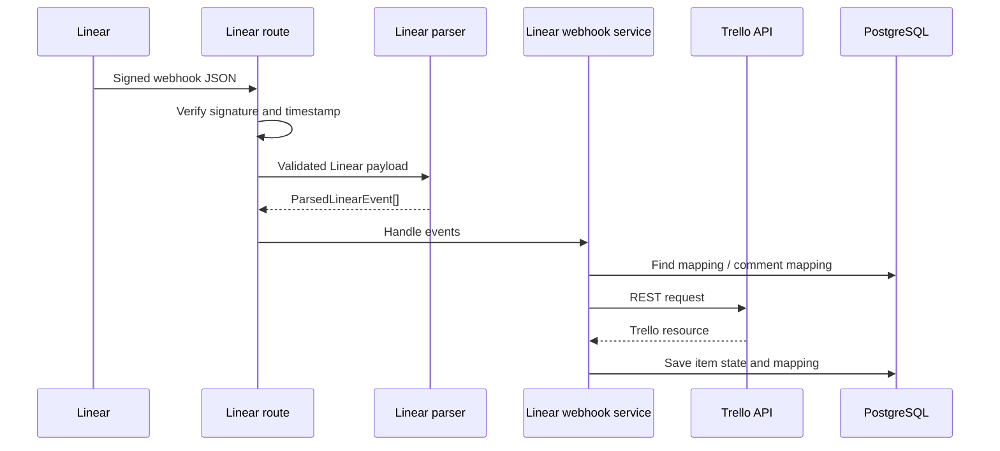

# Linear to Trello Sync

## Pipeline

```text
POST /webhooks/linear
-> routes/linear.ts
-> schemas/linear.ts
-> parser/linear.ts
-> sync/linear-sync-command.ts
-> services/linear-webhook.service.ts
-> services/trello-api.service.ts
-> packages/db
```



## Route Behavior

`apps/server/src/routes/linear.ts`:

1. Reads the raw request body.
2. Verifies `Linear-Signature` when `LINEAR_WEBHOOK_SECRET` is configured.
3. Rejects signed webhooks outside a 60-second timestamp window.
4. Parses and validates JSON with `linearWebhookSchema`.
5. Calls `parseLinearEvents`.
6. Sends all parsed events to `handleLinearWebhook`.
7. Returns `{ "ok": true }`.

When `LINEAR_WEBHOOK_SECRET` is absent, signature and replay-window validation are disabled.

## Supported Event Transformations

| Linear event | Trello command |
|---|---|
| `issue.created` | `trello.card.create` |
| `issue.renamed` | `trello.card.rename` |
| `issue.description_changed` | `trello.card.description_update` |
| `issue.due_date_changed` | `trello.card.due_date_update` |
| `issue.state_changed` | `trello.card.status_update` |
| Archived or removed issue | `trello.card.archive` |
| Restored issue | `trello.card.reopen` |
| `issue.commented` | `trello.comment.create` |

## Create Example

Example payload: [issue-created.json](../examples/linear/issue-created.json)

```text
Linear issue create JSON
-> issue.created
-> trello.card.create
-> map Linear state to Trello list
-> check mapping by Linear issue ID
-> create Trello card
-> cache both items
-> create item mapping
```

If an existing mapping points to an archived Trello card, the service reopens the card instead of creating another one.

## Multiple Changed Fields

Linear provides previous values in `updatedFrom`. The parser checks every supported field and returns multiple events when needed.

Example:

```text
updatedFrom.title + updatedFrom.description + updatedFrom.dueDate
-> issue.renamed
-> issue.description_changed
-> issue.due_date_changed
```

## Priority Representation

Linear priorities are converted from numbers:

| Number | Priority |
|---:|---|
| `0` | No Priority |
| `1` | Urgent |
| `2` | High |
| `3` | Medium |
| `4` | Low |

Trello has no equivalent priority field in this implementation. A priority marker such as `** High` is added to the beginning of the Trello card description. Existing recognized priority-marker lines are removed before the new marker is written.

## Errors

Command execution errors are caught and logged inside `handleLinearWebhook`. The HTTP route still returns success. This is a known reliability limitation.
