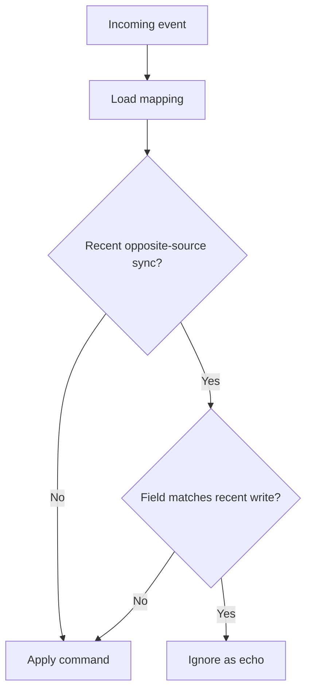

# Loop Prevention

## The Problem

Without loop prevention:

```text
Trello change
-> application updates Linear
-> Linear webhook arrives
-> application updates Trello
-> Trello webhook arrives
-> repeat
```

## Current Mechanism

Each item mapping stores:

- `lastSyncSource`
- `lastSyncedAt`

Before writing to the opposite platform, the sync service updates these fields. A webhook arriving from the opposite system within 30 seconds may be treated as an echo.



## Field-Aware Checks

Some fields receive additional checks:

- Linear status updates compare Linear state and cached Trello list state.
- Linear description/priority updates compare cached Linear values.
- Trello description updates compare cached Trello description.

Other commands mainly rely on the 30-second source/timestamp window.

## Comment Loop Prevention

Comments use unique comment mappings:

- Trello-originated comments are checked by Trello action ID.
- Linear-originated comments are checked by Linear comment ID.

## Limitations

- Timing-only checks can ignore legitimate edits made within the echo window.
- Delayed webhooks outside the window can create echoes.
- The timestamp is marked before the external API write completes.
- There is no persistent field fingerprint.
- There is no per-item lock, so simultaneous events can race.

## Planned Direction

Add durable event IDs, synced field fingerprints, completion metadata, and per-item sequential processing. See [Roadmap](../roadmap/roadmap.md).
