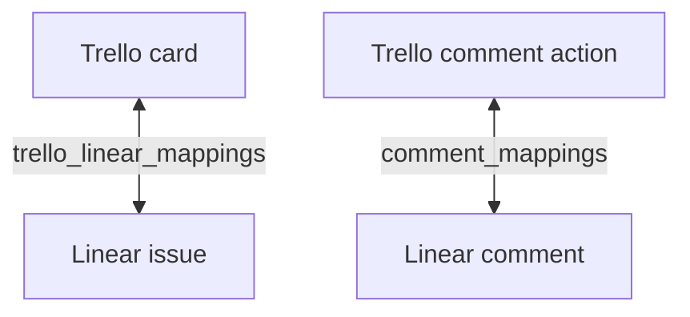

# Sync Overview

## Goal

A mapped Trello card and Linear issue represent the same work item. Changes on either platform should be reflected on the other platform without creating duplicate items, duplicate comments, or endless echo loops.

## Current Synchronization Model



The application supports:

- Item creation in either direction.
- Title, description, due date, status/list, archive, and reopen updates.
- Comments in either direction.
- Trello priority conventions mapped to Linear priority.
- Linear priority written into the Trello description.
- Multiple supported field changes from one webhook.

## Core Terms

### Webhook payload

Raw provider JSON received by an HTTP route.

### Parsed event

A normalized description of a source change, such as:

```text
card.renamed
issue.state_changed
issue.commented
```

### Sync command

A destination action built from a parsed event, such as:

```text
linear.issue.renamed
trello.card.status_update
trello.comment.create
```

### Item mapping

A one-to-one database relationship between a Trello card ID and Linear issue ID.

### Comment mapping

A database relationship between a Trello comment action ID and Linear comment ID.

### Echo

A webhook caused by the application writing to the opposite platform. Echoes should normally be ignored to avoid loops.

## Source Ownership

The current system uses last-write behavior with short-window echo suppression. It does not yet implement permanent field ownership or conflict resolution for simultaneous edits.

## Missing Reliability Features

- Persistent webhook event deduplication.
- Per-item locks or queue grouping.
- Automatic retries with backoff.
- Failed-job storage.
- Durable field fingerprints.
- Conflict resolution policy.

See [Roadmap](../roadmap/roadmap.md).
