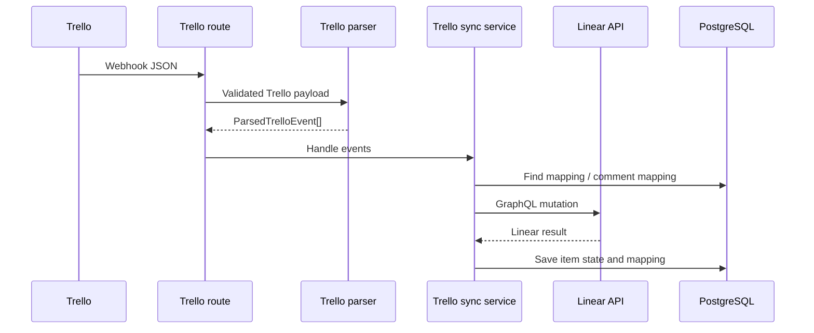

# Trello to Linear Sync

## Pipeline

```text
POST /webhooks/trello
-> routes/trello.ts
-> schemas/trello.ts
-> parser/trello.ts
-> sync/trello-sync-command.ts
-> services/trello.service.ts
-> services/linear.service.ts
-> packages/db
```



## Route Behavior

`apps/server/src/routes/trello.ts`:

1. Supports Trello webhook `HEAD` verification.
2. Reads JSON from `POST /webhooks/trello`.
3. Validates it with `trelloWebhookSchema`.
4. Logs useful action fields.
5. Calls `parseTrelloEvents`.
6. Sends all parsed events to `handleTrelloWebhook`.
7. Returns `{ "ok": true }`.

Trello webhook signature validation is not currently implemented.

## Supported Event Transformations

| Trello event | Linear command |
|---|---|
| `card.created` | `linear.issue.create` |
| `card.renamed` | `linear.issue.renamed` |
| `card.description_changed` | `linear.issue.description_update` |
| `card.due_date_changed` | `linear.issue.due_date_update` |
| `card.moved` | `linear.issue.status_update` |
| `card.deleted` | `linear.issue.close` |
| Archived card | `linear.issue.close` |
| Unarchived card | `linear.issue.reopen` |
| `card.commented` | `linear.comment.create` |

Label events are parsed but currently become `noop` commands.

## Create Example

Example payload: [card-created.json](../examples/trello/card-created.json)

```text
createCard JSON
-> card.created
-> linear.issue.create
-> check mapping by Trello card ID
-> create Linear issue
-> cache both items
-> create item mapping
```

Important limitation: the Linear issue is created before the mapping is written. Concurrent deliveries can race.

## Multi-Field Update Example

A Trello `updateCard` payload may contain several fields in `data.old`. The parser creates one event for every supported changed field. The sync service processes those events sequentially.

Example:

```text
old.name + old.desc + old.due
-> card.renamed
-> card.description_changed
-> card.due_date_changed
```

## Priority Mapping

When creating or updating a Linear issue, priority can be derived from:

1. Trello labels.
2. Individual lines in the Trello description.
3. Trello list names configured as priority lists.

The first matching configured token wins.

## Missing Mapping Behavior

For updates and comments, the service logs the missing mapping and skips the command. It does not automatically create a counterpart for an update event.

## Errors

Command execution errors are caught and logged inside `handleTrelloWebhook`. The HTTP route still returns success. This prevents provider retries and is a known reliability limitation.
